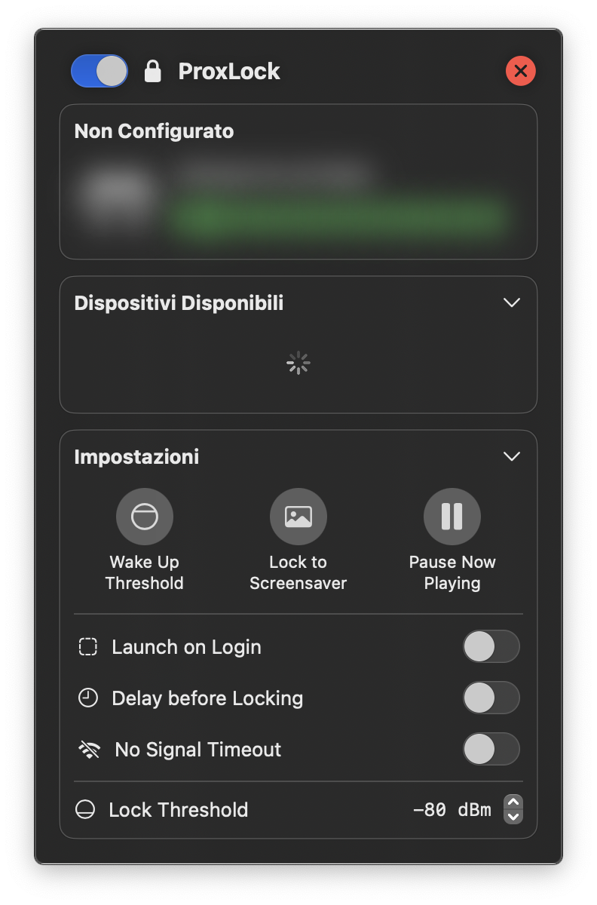

ProxLock Icon Placeholder

# **ProxLock**

ProxLock is a small native utility app that runs in your macOS menu bar and allows you to automatically lock and wake up your Mac by monitoring how far away
you are from it. In order to do that, is connects via Bluetooth with one of your Apple devices, such as an Apple Watch, AirPods, or iPhone.

- When you're close to your Mac, ProxLock will attempt to wake him up and redirect you to the lock screen. At this point you either enter your password,
use Touch ID or, for the most streamlined experience, use the built-in "Unlock with Apple Watch" to jump straight at the Desktop without
you doing absolutely anything.

- When you're farther away, ProxLock will lock the screen by putting Mac to sleep (black screen) or by jumping to tyhe screensaver. For this option to work, I'm planning to add a requirement for the "Immediately ask for password after screensaver" option to be on, in order to avoid potential
security vulnerabilities.

## Development Status

This app is, as of now, in a very Alpha state. Most of the UI code is there and it's working, but the underneath logic which does the heavy lifting and interacts with Bluetooth devices is almost non-existing. I'm working on this in my spare time, which is currently at an all time low, due to University and other projects I'm working on. 

In addition to implementing the core functionalities described above, I'd like to:

- Implement a way to run user-defined scripts when ProxLock locks or unlocks Mac;
- Implement some code that removes Apple Watch from the usable devices if it's off the wrist for some reason. That could be useful in cases where the watch is charging: since it's still on, it will continue to emit a Bluetooth signal, but that is useless to infer how distant the user is from the computer (it could trigger a lock event if you move away from the charging Apple Watch!).

## Inspiration

I took inspiration from a very cool open-source project named [`BLEUnlock`](https://github.com/ts1/BLEUnlock) by [Takeshi Sone](https://github.com/ts1), and decided to rewrite it from scratch using SwiftUI.

## Requirements

- A Mac that supports Bluetooth LE and runs macOS Sonoma (or newer). Actually, I might add support for Ventura, as soon as I figure out how to handle deprecated Swift functions.
- iPhone >= 5s / any kind of Apple Watch / any kind of AirPods.

## Authors

- **Fabio Colonna** - [fabcolonna](https://github.com/fabcolonna)

## License

ProxLock is under the MIT License.
